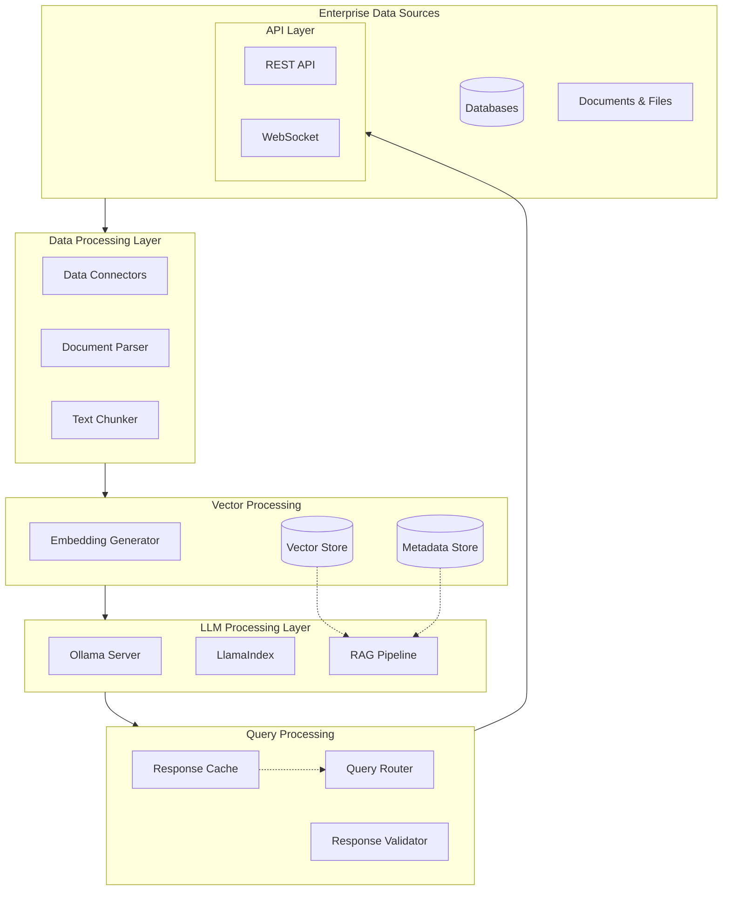

# ENTERPRISE DATA ANALYZER

## DATA SOURCE

Enterprise Data Sources

- Structured Data (Databases)
  - SQL Databases
  - NoSQL Databases
- Unstructured Data
  - Documents (PDFs, DOCs)
  - Text Files
- Semi-structured Data
  - JSON Files
  - XML Documents

## DATA PROCESSING PIPELINE

```markdown
Raw Data → Data Connector → Data Chunking → Vector Embedding → Vector Store
                                   │
                                   └── Metadata Extraction
```

## FLOWCHART



### Branching Strategy

- **main**: Production-ready code
- **develop**: Integration branch for features
- **feature/\***: New features and non-emergency fixes
- **hotfix/\***: Emergency production fixes
- **release/\***: Release preparation
